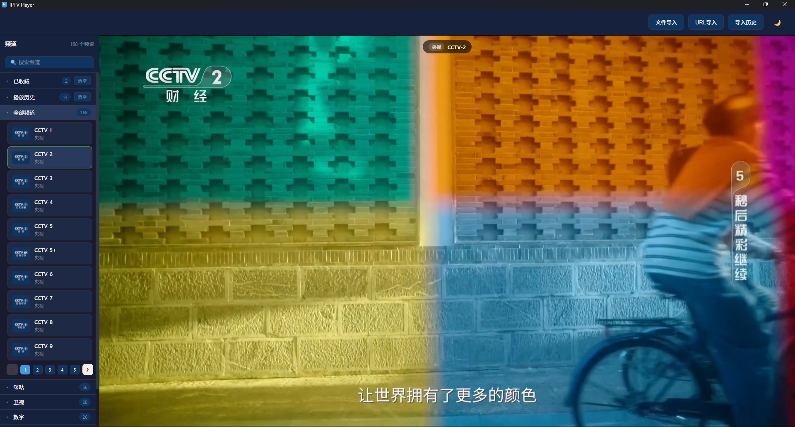

# IPTV Player

基于 **Tauri v2** 与 **Vue 3** 开发的 Windows 桌面 IPTV 播放器。导入 M3U 播放列表，分组浏览、收藏频道、记录历史，一键切换明暗主题。

## 下载

首个正式版已发布，前往 [Releases](https://github.com/cencuansen/IPTV_Player/releases) 下载：

- **`IPTV.Player_1.0.0_x64-setup.exe`** — Windows x64 安装向导（推荐）
- **`IPTV.Player_1.0.0_x64_en-US.msi`** — Windows x64 MSI 安装包

> 安装包未做代码签名，Windows 首次运行会提示「未知发布者」，点击「仍要运行」即可。

## 截图

<p align="center">
  
</p>

## 功能特性

- 📁 **文件导入** - 支持导入 M3U / M3U8 / TXT 格式的播放列表文件
- 🔗 **URL 导入** - 从网络地址导入播放列表
- 📊 **多数据源管理** - 同一 URL / 文件路径自动去重，保留全部导入记录，随时回看源详情
- 📂 **分组管理** - 自动按 `group-title` 组织频道，支持快速切换
- 🔍 **关键词搜索** - 实时搜索频道名称和分组（300ms 防抖）
- 📄 **分页浏览** - 每个分组内独立分页，每页 10 个频道
- ⭐ **频道收藏** - 收藏常用频道，按 URL 去重，最新收藏置顶
- 🔄 **收藏排序** - 在「已收藏」分组内直接拖动频道卡片调整顺序，自动保存
- 📤 **收藏导出** - 一键将全部收藏导出为单个 M3U8 文件（保留台标与分组）
- 🕘 **播放历史** - 自动记录播放记录（最多 100 条），一键回放
- 🎬 **HLS 支持** - 内置 hls.js，支持 m3u8 流媒体播放与媒体类型自动识别
- 🖼️ **台标显示** - 自动显示频道 logo
- 🌙 **深色/浅色模式** - 一键切换主题，自动保存偏好

## 使用方法

### 导入播放列表

1. 点击右上角「📁 文件导入」按钮，选择本地的 M3U / M3U8 文件
2. 或点击「🔗 URL导入」按钮，输入播放列表的网络地址
3. 多次导入的列表会保留在「导入历史」中，可随时切换或查看源详情

### 浏览频道

- 左侧边栏显示所有分组，点击切换分组
- 顶部搜索框可实时搜索频道名称和分组
- 频道列表支持分页，使用底部分页控件翻页

### 播放频道

- 点击任意频道卡片即可开始播放
- 播放器支持暂停、音量调节、全屏等控制
- 正在播放的频道会高亮显示
- 点击频道卡片上的 ★ 收藏，之后可在收藏中快速回放

### 管理收藏

- 点击频道卡片上的 ★ 收藏或取消收藏，收藏按 URL 去重
- 「已收藏」分组固定在列表最上方，在分组内直接拖动频道卡片即可调整顺序，顺序会自动保存
- 点击「已收藏」分组头部的「全部导出」按钮，可将全部收藏导出为一个 M3U8 文件，文件保留台标与原始分组，可直接重新导入
- 「已收藏」与「播放历史」分组均提供「清空」按钮

### 切换主题

- 点击右上角月亮/太阳图标切换深色/浅色模式
- 主题偏好会自动保存

## 项目结构

```
iptv-player/
├── index.html                  # Vite 入口 HTML
├── package.json                # npm 配置
├── vite.config.js              # Vite 配置
├── screenshots/                # 项目截图
│   └── 1.png
├── src/                        # 前端代码（Vue 3）
│   ├── App.vue                 # 根组件
│   ├── main.js                 # Vue 入口
│   ├── style.css               # 全局样式
│   ├── components/             # UI 组件
│   │   ├── AppHeader.vue       #   顶部栏（导入/主题切换）
│   │   ├── Sidebar.vue         #   侧边栏（搜索 + 分组列表）
│   │   ├── GroupList.vue       #   分组导航
│   │   ├── GroupSection.vue    #   分组频道展示
│   │   ├── GroupPagination.vue #   分页控件
│   │   ├── ChannelCard.vue     #   频道卡片
│   │   ├── PlayerSection.vue   #   视频播放器
│   │   ├── UrlImportModal.vue  #   URL 导入弹窗
│   │   ├── HistoryModal.vue    #   导入历史弹窗
│   │   └── SourceDetailModal.vue # 源详情弹窗
│   ├── stores/                 # Pinia 状态管理
│   │   ├── channels.js         #   频道列表 / 搜索
│   │   ├── favorites.js        #   频道收藏
│   │   ├── playHistory.js      #   播放历史
│   │   ├── player.js           #   播放器状态
│   │   ├── sources.js          #   数据源管理
│   │   └── theme.js            #   主题偏好
│   ├── player/
│   │   └── TauriHttpLoader.js  #   Tauri HTTP 加载器
│   └── utils/                  # 工具函数
│       ├── clipboard.js        #   剪贴板
│       ├── http.js             #   HTTP 请求
│       ├── logo.js             #   台标处理
│       ├── m3u.js              #   M3U 解析
│       ├── mediaType.js        #   媒体类型识别
│       └── storage.js          #   本地存储
└── src-tauri/                  # Rust 后端
    ├── Cargo.toml              # Rust 依赖配置
    ├── tauri.conf.json         # Tauri 配置
    ├── build.rs                # 构建脚本
    ├── icons/                  # 应用图标
    └── src/
        └── main.rs             # Rust 主程序
```

## 开发命令

```bash
# 安装依赖
npm install

# 开发模式运行（热更新）
npm run tauri:dev

# 构建发布版本（生成 NSIS + MSI 安装包）
npm run tauri:build
```

## 技术栈

- **桌面框架**: [Tauri v2](https://tauri.app/) + Rust
- **前端框架**: [Vue 3](https://vuejs.org/)（Composition API + `<script setup>`）
- **状态管理**: [Pinia](https://pinia.vuejs.org/) + `pinia-plugin-persistedstate`
- **构建工具**: [Vite](https://vitejs.dev/)
- **播放器**: [hls.js](https://github.com/video-dev/hls.js) + HTML5 Video
- **Tauri 插件**:
  - `tauri-plugin-dialog` - 文件选择对话框
  - `tauri-plugin-fs` - 文件系统访问
  - `tauri-plugin-http` - HTTP 请求

## M3U 格式支持

支持标准 M3U 格式，包含以下属性：

- `#EXTINF:` - 频道信息
- `tvg-logo` - 频道台标 URL
- `group-title` - 分组名称

示例：

```
#EXTM3U
#EXTINF:-1 tvg-logo="https://example.com/logo.png" group-title="新闻",CCTV-1 综合
https://example.com/stream.m3u8
```

## 许可证

本项目采用 [MIT 许可证](LICENSE) 开源。
